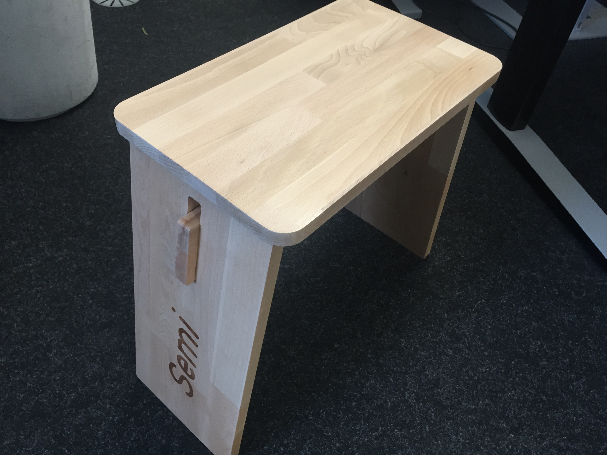

# JohannStool

## Fotos

In the CNC-Milling Machine:

All the parts:

My first stool assembled:

Using a Laser Cutter to engrave text:

Stool for the [Mechartlab](http://mechatronicart.ch/):

Attribution Label:

Stool for Semi:

