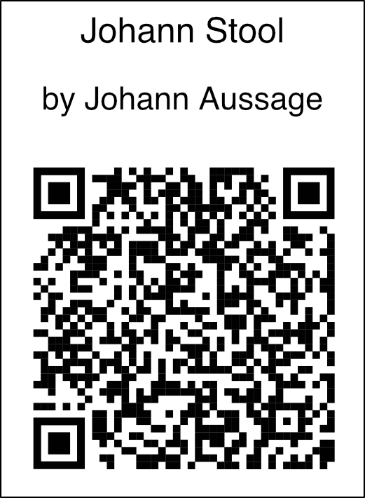

# JohannStool

The files required to create your own Johann Stool are available on the [opendesk.cc](https://www.opendesk.cc/nouvelle-fabrique/johann-stool) website.
This repository contains additional files and tips. The following Attribution Label was used:

I am using the CNC-Milling Machine and the Laser-Cutter at the [FabLab Zurich](http://zurich.fablab.ch/) to create these stools.

## Fotos

In the CNC-Milling Machine:

All the parts:

My first stool assembled:

## Tools and Materials
* Johann Stool [design files](https://www.opendesk.cc/nouvelle-fabrique/johann-stool)
* Autodesk Fusion360 [Product Page](http://autodesk.com/products/fusion-360/overview) more information about [Hobbyist and Education License](https://www.autodesk.com/products/fusion-360/students-teachers-educators)
* Laser-Cutter [Epilog 36EXT @ FabLab Zurich](http://wiki.zurich.fablab.ch/index.php?title=Epilog_36EXT)
* CNC-Milling Machine [MillStep PA V3 @ FabLab Zurich](http://wiki.zurich.fablab.ch/CNC_Fräse)
* [QR-Code-Monkey](https://www.qrcode-monkey.com/)
* Leimholzplatte [Paulownia 2200 x 500 x 18](https://www.bauhaus.info/leimholzplatten/exclusivholz-leimholzplatte-/p/14084266)
* Leimholzplatte [Buche 1200 x 300 x 18](https://www.bauhaus.info/leimholzplatten/buche-leimholz-bc-1200x300x18mm/p/14076700)
* [UHU Holzleim Wasserfest](http://www.uhu.com/produkte/holzleime/detail/uhu-holzleim-wasserfestdin-en-204-d3.html) @ [Bauhaus](https://www.bauhaus.info/holzleim/holzleim-wasserfest-250g-en-204-uhu/p/15352519?q=uhu%20holzleim%20wasserfest)
* [Aqua Clou Wachslasur Farblos](http://www.clou.de/bau-heimwerker/produkte/produktansicht/lasuren/aqua-clou-wachslasur/) @ [Coop Bau & Hobby](https://www.bauundhobby.ch/bauen-+-renovieren/holz/holzbehandlung/spezial-innen/clou-aqua-wachslasur-w11-farblos-250-ml/C06020603/P3226834/de)
* 
* Fonts: TGL 0-16 and TGL 31034-2 from [TGL Font Family](http://www.1001fonts.com/tgl-font.html)
