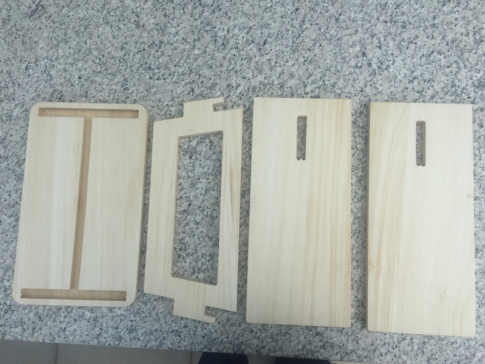
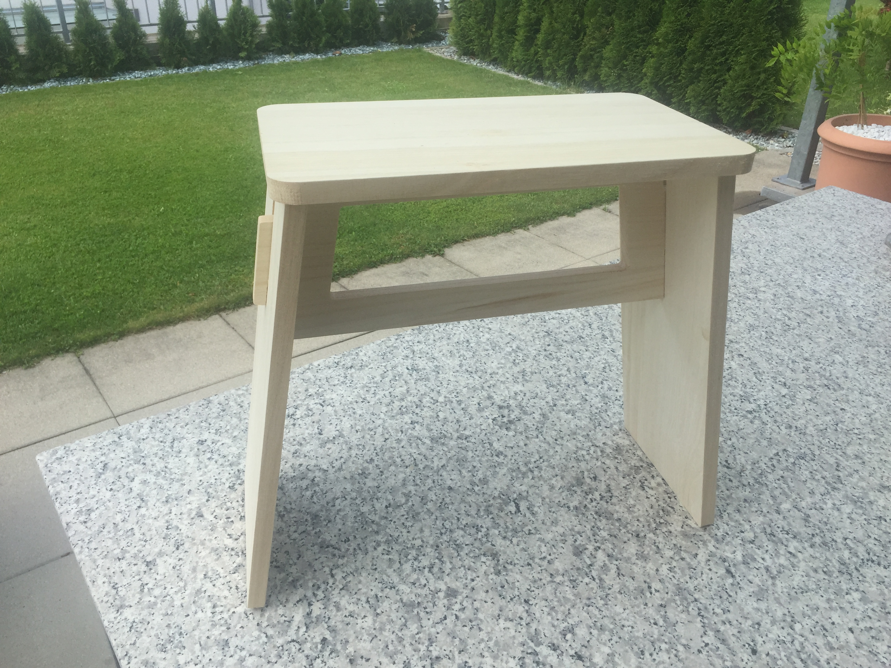

# JohannStool

The files required to create your own Johann Stool are available on the (opendesk.cc)[https://www.opendesk.cc/nouvelle-fabrique/johann-stool] website.
This repository contains additional files and tips. The following Attribution Label was used:

I am using the CNC-Milling Machine and the Laser-Cutter at the [FabLab Zurich](http://zurich.fablab.ch/) to create these stools.

## Fotos

In the CNC-Milling Machine:

All the parts:

My first stool assembled:

## Tools and Materials
* Johann Stool [design files](https://www.opendesk.cc/nouvelle-fabrique/johann-stool)
* Laser-Cutter [Epilog 36EXT @ FabLab Zurich](http://wiki.zurich.fablab.ch/index.php?title=Epilog_36EXT)
* CNC-Milling Machine [MillStep PA V3 @ FabLab Zurich](http://wiki.zurich.fablab.ch/CNC_Fräse)
* Leimholzplatte [Paulownia 2200 x 500 x 18](https://www.bauhaus.info/leimholzplatten/exclusivholz-leimholzplatte-/p/14084266)
* Leimholzplatte [Buche 1200 x 300 x 18](https://www.bauhaus.info/leimholzplatten/buche-leimholz-bc-1200x300x18mm/p/14076700)
* Fonts: TGL 0-16 and TGL 31034-2 form [TGL Font Family](http://www.1001fonts.com/tgl-font.html)
